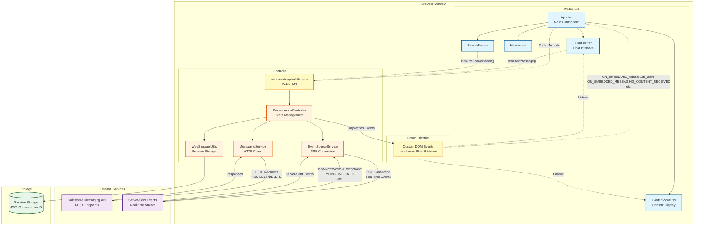

# Adaptive Web Agent Component

## Description

The Adaptive Web Agent Component is a UI component designed to be added to websites via the Web Personalization Manager (WPM) or Data Cloud WebSDK. It serves as a custom client for Agentforce, supporting both the Embedded Service Messaging API and the direct Agentforce API.

**Two UI implementations are available:**
- **React** (`/app`) - Full-featured React implementation
- **Lightning Web Components** (`/lwc-app`) - LWC implementation for Salesforce platform alignment

## Project Structure

This repository contains multiple packages, each with its own build process:

### `/app`
The React application that provides the user interface for the Adaptive Web Agent component. This package contains:
- React components for the chat interface and content zone
- Event listeners that communicate with the controller
- UI templates for rendering curated content

See [app/README.md](app/README.md) for detailed documentation.

### `/lwc-app`
The Lightning Web Components (LWC) implementation of the UI. This package contains:
- LWC components mirroring the React app functionality
- Same event-driven architecture as the React version
- Built with open-source LWC for browser deployment

See [lwc-app/README.md](lwc-app/README.md) for detailed documentation.

### `/controller`
The controller library that manages conversation state and acts as an intermediary between the UI app and the Salesforce APIs. This package:
- Manages conversation lifecycle and authentication
- Handles Server-Sent Events (SSE) connections
- Supports both Embedded Service Messaging API and Agentforce API
- Exposes the public `window.AdaptiveWebsite` API
- Dispatches custom DOM events to communicate with the app

See [controller/README.md](controller/README.md) for detailed documentation.

### `/scripts`
Contains utility scripts:
- `create-sdk-output.js` - Combines the React app and controller into a single SDK output file
- `create-lwc-output.js` - Combines the LWC app and controller into a single SDK output file

## Architecture

The following diagram illustrates the high-level architecture and how the app and controller work together:



### Architecture Overview

The architecture follows a **separation of concerns** pattern:

1. **React App** (`/app`): 
   - Renders the UI (chat interface, content zone, header, search bar)
   - Listens to custom DOM events from the controller
   - Calls methods on `window.AdaptiveWebsite` to interact with conversations

2. **Controller** (`/controller`):
   - Manages conversation state and lifecycle
   - Handles authentication and API communication
   - Exposes `window.AdaptiveWebsite` public API
   - Dispatches custom DOM events to notify the app of updates

3. **Communication Flow**:
   - **App → Controller**: Method calls on `window.AdaptiveWebsite` (e.g., `sendTextMessage()`, `initializeConversation()`)
   - **Controller → App**: Custom DOM events dispatched on `window` (e.g., `ON_EMBEDDED_MESSAGE_SENT`, `ON_EMBEDDED_MESSAGING_CONTENT_RECEIVED`)

4. **External Services**:
   - **Salesforce Messaging API**: REST endpoints for conversation management
   - **Server-Sent Events (SSE)**: Real-time event stream for receiving messages and updates

5. **Storage**:
   - **Session Storage**: Persists JWT tokens, conversation IDs, and configuration across page refreshes

## Prerequisites

* **Node.js 20.19+ or 22.12+** (required by Vite 7)
  - Check version: `node --version`
  - Install via nvm: `nvm install 20 && nvm use 20`
* [Install NPM](https://docs.npmjs.com/cli/v11/commands/npm-install)
* [Configure Nexus NPM Repositories](https://confluence.internal.salesforce.com/pages/viewpage.action?spaceKey=NEXUS&title=Nexus+NPM+Repositories)

## Setup

### For React App

The controller must be built first, as the React app depends on it as a local tarball.

```sh
# 1. Install and build the controller first
cd controller
npm install
npm run build
npm pack

# 2. Then install React app dependencies
cd ../app
npm install
```

> **Note:** If you encounter integrity/checksum errors when installing the app (e.g., after rebuilding the controller), delete `app/node_modules` and `app/package-lock.json`, then run `npm install` again.

### For LWC App

The LWC app is standalone and doesn't require the controller tarball.

```sh
# 1. Build the controller
cd controller
npm install
npm run build

# 2. Install LWC app dependencies
cd ../lwc-app
npm install
```

## Building

Each package has its own build process. See the individual READMEs for details:
- [app/README.md](app/README.md#building-and-running) - React app build instructions
- [lwc-app/README.md](lwc-app/README.md) - LWC app build instructions
- [controller/README.md](controller/README.md#building-and-running) - Controller build instructions

### Quick Build Commands

```bash
# Build React SDK output (controller + React app)
node scripts/create-sdk-output.js

# Build LWC SDK output (controller + LWC app)
node scripts/create-lwc-output.js
```

## Creating SDK Output

Two output scripts are available depending on which UI implementation you want to use:

| Script | UI Framework | Output File | Description |
|--------|--------------|-------------|-------------|
| `scripts/create-sdk-output.js` | React | `dist/sdk-output.js` | React-based UI |
| `scripts/create-lwc-output.js` | LWC | `dist/lwc-sdk-output.js` | Lightning Web Components UI |

### React SDK Output

The script `scripts/create-sdk-output.js` combines the React app and controller:

1. Builds the controller (runs `npm run build` in the `controller` directory)
2. Packs the controller (runs `npm pack` in the `controller` directory to create a tarball)
3. Updates the app's controller dependency (runs `npm update adaptive-web-controller` in the `app` directory)
4. Builds the app (runs `npm run build` in the `app` directory)
5. Combines both outputs into `dist/sdk-output.js`

```bash
node scripts/create-sdk-output.js
```

### LWC SDK Output

The script `scripts/create-lwc-output.js` combines the LWC app and controller:

1. Builds the controller (runs `npm run build` in the `controller` directory)
2. Installs LWC app dependencies if needed
3. Builds the LWC app (runs `npm run build` in the `lwc-app` directory)
4. Combines both outputs into `dist/lwc-sdk-output.js`

```bash
node scripts/create-lwc-output.js
```

### Output Format

Both scripts generate a file containing two functions:

```javascript
function addControllerToPage() {
  // Contents of build file (controller/adaptive-web-controller.js)
  // [entire minified controller code here]
}

function addAppToPage() {
  // Contents of build file (app or lwc-app output)
  // [entire minified UI app code here]
}
```

**Note:** The scripts automatically build all required packages. Ensure the relevant directories have their dependencies installed before running:
- For React: `app` and `controller` directories
- For LWC: `lwc-app` and `controller` directories

Add the contents of the output file to the end of your sitemap.

### Add transfomer to sitemap

Add a transformer to the sitemap which stores attributes in session storage and calls the function created above.
Example:

```javascript
          {
            name: "SearchComponent",
            transformerType: "AgentScript",
            transformerCategory: "Agent",
            substitutionDefinitions: {
              OrganizationId: {
                defaultValue: '[attributes].[orgId]'
              },
              DeploymentDevName: {
                defaultValue: '[attributes].[deploymentDevName]'
              },
              MessagingURL: {
                defaultValue: '[attributes].[messagingURL]'
              },
              PecName: {
                defaultValue: '[attributes].[pecName]'
              }
            },
            transformerTypeDetails: {
              script: `
                if (window.sessionStorage.getItem("SEARCH_COMPONENT_WEB_STORAGE_{{subVar 'OrganizationId'}}") == null) {
                  window.sessionStorage.setItem("SEARCH_COMPONENT_WEB_STORAGE_{{subVar 'OrganizationId'}}", JSON.stringify({
                      ORGANIZATION_ID: "{{subVar 'OrganizationId'}}",
                      MESSAGING_URL: "{{subVar 'MessagingURL'}}",
                      DEPLOYMENT_DEVELOPER_NAME: "{{subVar 'DeploymentDevName'}}",
                      PEC_NAME: "{{subVar 'PecName'}}"
                  }))
              }
              window.addControllerToPage()
              window.addAppToPage()
              `
            },
            isEnabled: true
          }
```

### Add Personalization Point to org you are using

Create a personalization point using the NGSC_Template response template. 

### Add PEC to sitemp
Then create a PEC in the sitemap similar to the one below:

```javascript
          {
            name: "SearchComponent",
            dataProvider: {
              "type": "PersonalizationPoint",
              "referenceType": "ApiName",
              "value": "NG_Search_Component"
            },
            sourceMatchers: [
              {
                type: "PageType",
                value: "default"
              }
            ],
            transformationConfig: {
              when: "Immediately",
              transformations: [
                {
                  transformerName: "SearchComponent",
                }
              ]
            },
            lastModifiedDate: 1727893596990
          } 
```

## Event Model & Agent Response Payload

The Adaptive Web Agent Component uses a custom event-driven architecture to receive and process responses from the Agentforce backend. When an agent sends a message, the `ConversationController` in `controller/src/conversation.ts` parses the response and dispatches a `CustomEvent` to update various UI components in the app.

### Event Flow

1. **Server-Sent Event (SSE)** arrives from the MIAW API containing an agent message
2. **ConversationController** parses the message and extracts JSON content from `staticContent.text`
3. **Custom Event** (`onEmbeddedMessagingContentReceived`) is dispatched with the parsed payload
4. **UI Components** (ChatBot, ContentZone) listen for this event and update accordingly

### Payload Structure

Agent responses should be formatted as JSON with the following fields:

| Field | Type | Purpose |
|-------|------|---------|
| `text` | `string` | Text message displayed in the Chat Window |
| `curation` | `object` | Personalization data passed to the ContentZone for rendering product recommendations, content, etc. |
| `template` | `array` | Specifies which template(s) to use for rendering content in the ContentZone |
| `options` | `array` | Single-click button options displayed in the Chat Window for quick user responses |

### Example Payload

```json
{
  "text": "Here's a comparison of top hiking boots",
  "curation": {
    "products": [
      {
        "id": "2050942",
        "image": "https://s3.amazonaws.com/northerntrailoutfitters.com/nto-apparel/default/images/large/2050942APE-0.jpg",
        "name": "Women's Safien Gtx Hiking Shoes",
        "price": "$140.00",
        "rating": 4.5,
        "features": [
          { "name": "Waterproof", "value": "Yes (GTX)" },
          { "name": "Category", "value": "Hiking" },
          { "name": "Weight", "value": "Light" }
        ]
      },
      {
        "id": "2050934",
        "image": "https://s3.amazonaws.com/northerntrailoutfitters.com/nto-apparel/default/images/large/2050934AOC-0.jpg",
        "name": "Women's Flight Trinity Running Shoes",
        "price": "$140.00",
        "rating": 4.3,
        "features": [
          { "name": "Waterproof", "value": "No" },
          { "name": "Category", "value": "Trail Running" },
          { "name": "Weight", "value": "Ultra-light" }
        ]
      },
      {
        "id": "2050075",
        "image": "https://s3.amazonaws.com/northerntrailoutfitters.com/nto-apparel/default/images/large/2050075AIX-0.jpg",
        "name": "Women's Renew Boot",
        "price": "$130.00",
        "rating": 4.7,
        "features": [
          { "name": "Waterproof", "value": "Yes" },
          { "name": "Category", "value": "Boots" },
          { "name": "Weight", "value": "Medium" }
        ]
      }
    ]
  },
  "template": [
    { "name": "Comparison" }
  ]
}
```

### JSON Schema

The following JSON Schema defines the official contract for agent response payloads:

```json
{
  "$schema": "https://json-schema.org/draft/2020-12/schema",
  "$id": "https://salesforce.com/adaptive-web-agent/agent-response-payload.schema.json",
  "title": "Agent Response Payload",
  "description": "Schema for Adaptive Web Agent Component responses from Agentforce",
  "type": "object",
  "properties": {
    "text": {
      "type": "string",
      "description": "Text message displayed in the Chat Window"
    },
    "curation": {
      "type": "object",
      "description": "Personalization data passed to the ContentZone for rendering. Can contain any structure.",
      "additionalProperties": true
    },
    "template": {
      "type": "array",
      "description": "Specifies which template(s) to use for rendering content in the ContentZone",
      "items": {
        "type": "object",
        "properties": {
          "name": {
            "type": "string",
            "description": "Name of the template component to use"
          }
        },
        "required": ["name"]
      }
    },
    "options": {
      "type": "array",
      "description": "Quick-action buttons displayed in the Chat Window",
      "items": {
        "type": "object",
        "properties": {
          "name": {
            "type": "string",
            "description": "Text displayed on the button and value sent when clicked"
          }
        },
        "required": ["name"]
      }
    }
  },
  "additionalProperties": false
}
```

### Field Details

#### `text`
The `text` field contains the conversational message that appears in the ChatBot message bubble. This is the human-readable response from the agent.

#### `curation`
The `curation` object contains personalization data from Data Cloud. The structure can vary based on the template being used. For example:
- **products**: Array of product objects (for `Recs` and `Comparison` templates) with fields like `id`, `image`, `name`, `price`, `rating`, and `features`
- **product**: Single product object (for `ProductDetails` template) with the same structure as products array items
- **bannerImage**: Optional banner image URL (for `Recs` template)
- Other fields may be included based on specific template requirements

#### `template`
The `template` array specifies which ContentZone template(s) should render the curation data. Templates are React components located in `app/src/components/templates/`. The `name` field maps to the template component to use (e.g., `"Recs"`, `"Comparison"`, `"ProductDetails"`).

#### `options`
The `options` array defines quick-action buttons displayed below the agent message in the Chat Window. Each option has:
- **name**: Text displayed on the button (also used as the value sent back to the agent when clicked)

This allows users to respond with a single click rather than typing, improving the conversational UX.
