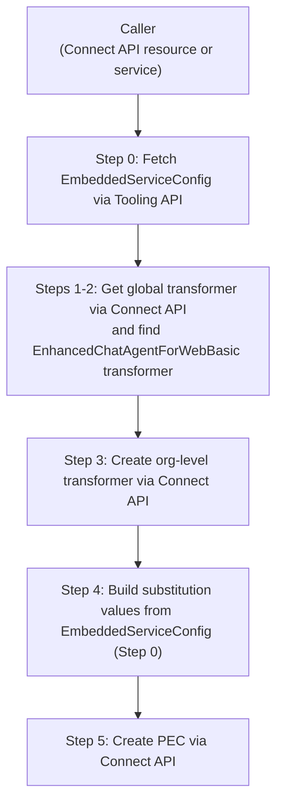

# Agent Transformer + PEC Creation Flow

A overview of what APIs we might need to call in core that fetches an EmbeddedServiceConfig (user-selected), finds the existing global transformer for launching agents on the web, copies it as an org-level transformer, then creates a PersonalizationExperienceConfig with substitution values derived from the embedded service config.

## Architecture Overview




---

## Step 0: Fetch the EmbeddedServiceConfig via Tooling API

The caller passes in the selected ESC developer name. Use `[P13nSoqlHelper.executeToolingQuery()](p13n-impl/java/src/p13n/impl/helpers/P13nSoqlHelper.java)`

```java
String soql = SoqlBuilder.get()
    .select(Set.of("Id", "DeveloperName", "SiteId"))
    .from(EmbeddedServiceConfigStandardEntity.INSTANCE.getApiName())
    .where(And.and(
        Condition.equalTo(EmbeddedServiceConfigStandardFields.DeveloperName.getName(), esConfigDeveloperName),
        Condition.equalTo(EmbeddedServiceConfigStandardFields.IsDeleted.getName(), false)
    ))
    .toSoql(SoqlOptions.DONOT_ESCAPE_QUOTES_IN_IN);

List<Entity> records = P13nSoqlHelper.executeToolingQuery(soql);
Entity esConfig = records.get(0);
```

Fields needed from the result:

- `DeveloperName` — for the `name` substitution value
- `SiteId` — then resolve the Site's secure URL via `SiteUtils.get().getSiteById(siteId).getSecureUrl()`

---

## Steps 1–2: Fetch global transformer via Connect API

The Connect API endpoint `GET /services/data/vXX/personalization/external-apps/transformers?source=Global` is backed by `[TransformerCollectionResourceImpl](p13n-extapp-connect-impl/java/src/p__n/extapp/connect/impl/resources/TransformerCollectionResourceImpl.java)`, which implements the generated interface `ITransformersCollectionResource` (`sfdc.p13nextapp.connect.api.resources`). When `source=Global` is passed, it delegates to `PersnlTransformerDefaultConfig.getGlobalTransformers()` internally.

Inject `ITransformersCollectionResource` and call it with `source=Global`:

```java
Map<String, Parameter> params = Map.of(
    "source", new Parameter("source", "Global")
);
TransformerCollectionRepresentation result =
    (TransformerCollectionRepresentation) transformersResource.get(params).build();

TransformerRepresentation globalTemplate = result.getTransformers().stream()
    .filter(t -> "EnhancedChatAgentForWebBasic".equals(t.getName()))
    .findFirst()
    .orElseThrow(() -> new IllegalStateException("Global transformer EnhancedChatAgentForWebBasic not found"));
```

**NOTE: This might not be the exact global transformer/template that we use, but it will roughly look like this**

`EnhancedChatAgentForWebBasic` already exists in `GLOBAL_TRANSFORMERS` in `[PersnlTransformerDefaultConfig](p13n-impl/java/src/p13n/impl/configuration/externalapp/PersnlTransformerDefaultConfig.java)` 

Its substitution definitions are `bootstrapUrl`, `org`, `name`, `url`, `scrt2URL`.

---

## Step 3: Create the org-level transformer

Use `[TransformerService.save(TransformerInputRepresentation)](p13n-impl/java/src/p13n/impl/connect/service/externalapp/TransformerService.java)` (`[TransformerServiceImpl](p13n-impl/java/src/p13n/impl/connect/service/externalapp/TransformerServiceImpl.java)`):

```java
TransformerInputRepresentation input = new TransformerInputRepresentation();
input.setName(globalTemplate.getName());
input.setTransformerType(globalTemplate.getTransformerType());
input.setChannel(globalTemplate.getChannel());
input.setSubstitutionDefinitions(globalTemplate.getSubstitutionDefinitions());
input.setTransformerTypeDetails(globalTemplate.getTransformerTypeDetails());
input.setIsEnabled(false);

transformerService.save(input);  // creates org-level PersnlTransformerDef record
```

---

## Step 4: Build substitution values from the EmbeddedServiceConfig (*NOTE: needs more verification if we have all the info we need from Step 0*)

The Embedded Service Deployment "Code Snippet" is created here in Core: `core/ui-embedded-service-api/java/src/ui/embeddedservice/api/setup/snippet/LwcCodeSnippetBuilder.java`. This is a good reference point to see how they are fetching/generating the five fields below, which are needed for the Personalization Experience Config substitution values.

Map Embedded Service Deployment fields to the 5 substitution keys defined by `EnhancedChatAgentForWebBasic`:


| Key            | Value                                                                   | Code reference                                                                                                                                                 |
| -------------- | ----------------------------------------------------------------------- | -------------------------------------------------------------------------------------------------------------------------------------------------------------- |
| `bootstrapUrl` | `{siteSecureUrl}/assets/js/bootstrap.min.js`                            | ''                       |
| `org`          | 15-char org ID from `UserContext.get().getOrganizationId()`             | ''                 |
| `name`         | ESC full name (`{NamespacePrefix}__{DeveloperName}` or `DeveloperName`) | `[EmbeddedServicePublishAction](embedded-service/java/src/embeddedservice/connect/api/EmbeddedServicePublishAction.java#L1234)`                                |
| `url`          | `SiteUtils.get().getSiteById(siteId).getSecureUrl()`                    | `[EmbeddedServicePublishAction](embedded-service/java/src/embeddedservice/connect/api/EmbeddedServicePublishAction.java#L1242)`                                |
| `scrt2URL`     | `ScrtUriService.getScrt2MyDomain(orgId)`                                | `[EmbeddedMessagingEnhancedServiceUrlDataSource](sites/java/src/siteforce/communitybuilder/datasource/EmbeddedMessagingEnhancedServiceUrlDataSource.java#L94)` |


```java
String orgId = UserContext.get().getOrganizationId().substring(0, 15);
Map<String, Object> substitutionValues = Map.of(
    "bootstrapUrl", siteSecureUrl + "/assets/js/bootstrap.min.js",
    "org",          orgId,
    "name",         esConfigFullName,
    "url",          siteSecureUrl,
    "scrt2URL",     scrtUriService.getScrt2MyDomain(orgId)
);
```

---

## Step 5: Create the PersonalizationExperienceConfig

Use `[PersonalizationExperienceService.save(appSourceId, inputRepresentation)](p13n-impl/java/src/p13n/impl/connect/service/externalapp/PersonalizationExperienceService.java)` (`[PersonalizationExperienceServiceImpl](p13n-impl/java/src/p13n/impl/connect/service/externalapp/PersonalizationExperienceServiceImpl.java)`).

The key field is `TransformationInputRepresentation.substitutionValues` — a `Map<String, Object>` with the values from Step 4:

```java
TransformationInputRepresentation transformation = new TransformationInputRepresentation();
transformation.setTransformerName(globalTemplate.getName()); // "EnhancedChatAgentForWebBasic"
transformation.setSubstitutionValues(substitutionValues);

TransformationConfigInputRepresentation transformationConfig = new TransformationConfigInputRepresentation();
transformationConfig.setTransformations(List.of(transformation));

PersonalizationExperienceConfigInputRepresentation pecInput = new PersonalizationExperienceConfigInputRepresentation();
pecInput.setName(generatedName);
pecInput.setLabel(esConfigFullName);
pecInput.setIsEnabled(false);
pecInput.setTransformationConfig(transformationConfig);

personalizationExperienceService.save(appSourceId, pecInput);
```

`PersonalizationExperienceServiceImpl` resolves `transformerName` by developer name lookup in the UDD — it will find the org-level transformer created in Step 3.


### Example PEC after creation
```json
{
    "name": "EnhancedChatAgentForWebBasic_1772055981438",
    "label": "EnhancedChatAgentForWebBasic",
    "isEnabled": true,
    "sourceMatchers": [
        {
            "type": "PageType",
            "value": "default"
        }
    ],
    "transformationConfig": {
        "when": "Immediately",
        "transformations": [
            {
                "transformerName": "EnhancedChatAgentForWebBasic",
                "substitutionValues": {
                    "org": "00Dxx004p7aWmM8",
                    "name": "Dan_Web_Service_Deployment",
                    "url": "https://orgfarm-df3b38e650.my.site-com.i6r5huoe9p581cnr76dm6elu41.wc.crm.dev:6101/ESWDanWebServiceDeploy1771536699298",
                    "bootstrapUrl": "https://orgfarm-df3b38e650.my.site-com.i6r5huoe9p581cnr76dm6elu41.wc.crm.dev:6101/ESWDanWebServiceDeploy1771536699298/assets/js/bootstrap.min.js",
                    "scrt2URL": "http://orgfarm-df3b38e650.my.salesforce-scrt-com.i6r5huoe9p581cnr76dm6elu41.wc.crm.dev"
                }
            }
        ],
        "engagementDestination": "Other"
    }
}
```
